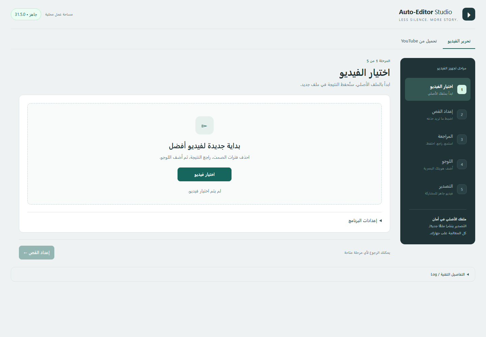
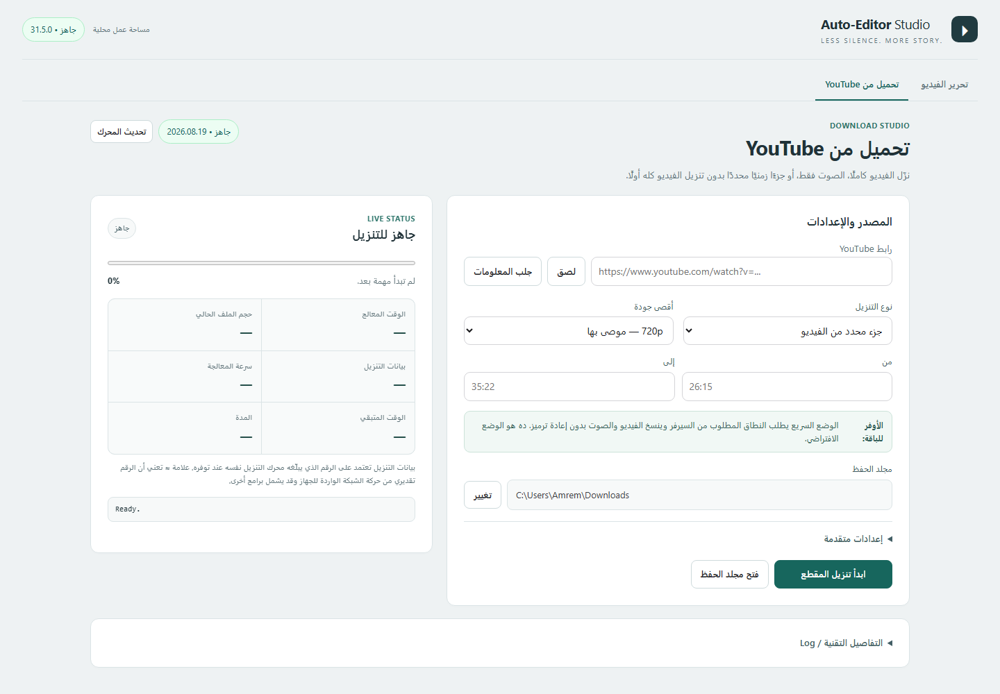

# CutCap Studio

A local-first Windows video workflow studio for cutting silence, reviewing edits, exporting editable CapCut timelines, adding watermarks, and downloading only the YouTube segment you actually need.

> **Status:** Windows-first, local development build. No telemetry, no cloud backend, and no uploaded media processing.

## Highlights

- **Silence-aware editing** powered by Auto-Editor.
- **Visual review workflow** with waveform, cut markers, keep/delete decisions, and smooth preview.
- **Editable CapCut export** instead of forcing a rendered intermediate.
- **Watermark editor** with drag, scale, and opacity controls.
- **YouTube downloader workspace** for:
  - selected time ranges,
  - full videos,
  - MP3 audio,
  - quality caps from 360p to 2160p / best.
- **Live download telemetry** including progress, processed time, output size, reported download bytes, speed, ETA, elapsed time, and cancellation.
- **Local-only architecture**: Node.js backend on `127.0.0.1` with a browser UI.
- **Responsive UI** verified down to a 390px viewport.

## Screenshots

### Video editing workspace



### YouTube download workspace



## Why this exists

Video workflows often end up split across several tiny tools: one for silence removal, another for downloading clips, another for CapCut handoff, and another for watermarking. CutCap Studio brings those jobs into one local workspace without uploading source media to a remote service.

## Architecture

```text
Browser UI
   |
   v
Local Node.js server
   |---- Auto-Editor
   |---- FFmpeg
   |---- yt-dlp
   `---- CapCut project export
```

The current architecture intentionally keeps the UI web-based while all privileged work stays in a local Node.js process. That makes the product easy to iterate on today and easy to wrap in a desktop shell later without rewriting the editor.

## Requirements

- Windows 10 or 11
- Node.js 20+
- Auto-Editor Windows executable
- yt-dlp
- FFmpeg

Third-party binaries are intentionally **not committed** to this repository.

The app currently discovers tools from common local locations, including:

- `auto-editor-windows-x86_64.exe` next to the launcher
- `yt-dlp.exe` next to the app or under the existing CutCap local installation
- `ffmpeg.exe` next to the app, system locations, or the existing CutCap FFmpeg installation

## Quick start

```powershell
git clone https://github.com/amrpyt/cutcap-studio.git
cd cutcap-studio
npm start
```

Then open:

```text
http://127.0.0.1:37906
```

On Windows you can also run:

```text
start-gui.bat
```

## Development

```powershell
npm test
npm run check
```

The test suite covers UI contracts, workflow state, long-running job behavior, local server behavior, CapCut export, cancellation, output locking, and YouTube download plumbing.

The Auto-Editor binary integration test automatically skips when the external executable is not present.

## YouTube partial downloads

For clip mode, CutCap Studio uses yt-dlp's section-download support and keeps **fast mode** as the default. It requests the selected time range and avoids re-encoding unless exact-cut mode is explicitly enabled.

The UI prefers byte counts reported by the download engine. If those are unavailable, it can fall back to an approximate whole-device receive counter and marks that value as approximate.

## Privacy

- Media processing happens locally.
- The app binds to `127.0.0.1`.
- No application telemetry is sent by CutCap Studio.
- Local preview/media tokens are ephemeral.
- Logs intentionally redact direct media URLs where practical.

External tools and the websites they contact have their own privacy policies.

## Repository notes

This repository does not currently declare an open-source license. Until a license is added, normal copyright rules apply.

## Roadmap

- [Local-first commercial platform & launch plan](docs/plans/2026-09-30-local-first-platform-launch.md)
- Project history and recent jobs
- Drag-and-drop imports
- Visual YouTube in/out selection from a preview player
- Presets for common export/download workflows
- Dependency bootstrap and health repair
- Packaged desktop installer
- Automatic app updates
- Release builds from GitHub Actions

## Disclaimer

CutCap Studio is an independent project and is not affiliated with YouTube, CapCut, Auto-Editor, or FFmpeg. Only download or process content you have the right to use.
